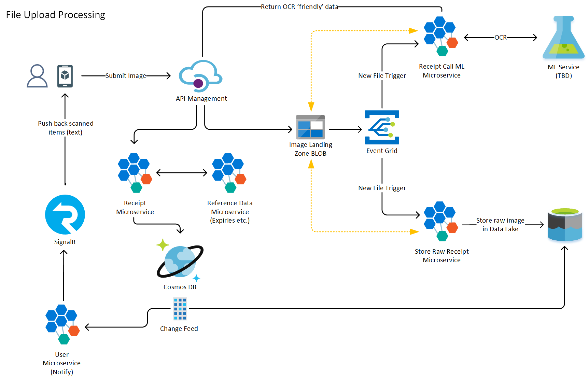

# PocketPantry
OzHarvest Pocket Pantry solution.

# Repositories
The PocketPantry solution is comprised of multiple components (Azure Infrastructure, Microservices, Mobile Client). You can find all PocketPantry repos in the following locations:

- [Pocket Pantry](https://github.com/insightapac/pocketpantry)
- [Infrastructure](https://github.com/insightapac/pocketpantry-infra)
- [Microservices](https://github.com/insightapac/pocketpantry-microservices)
- [Mobile Client](https://github.com/insightapac/pocketpantry-mobile)

# Architecture
## File Upload Processing

  

